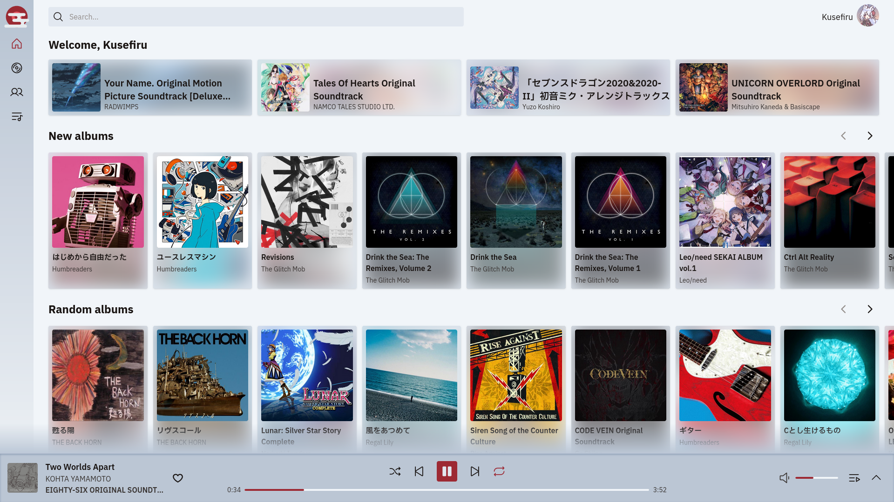
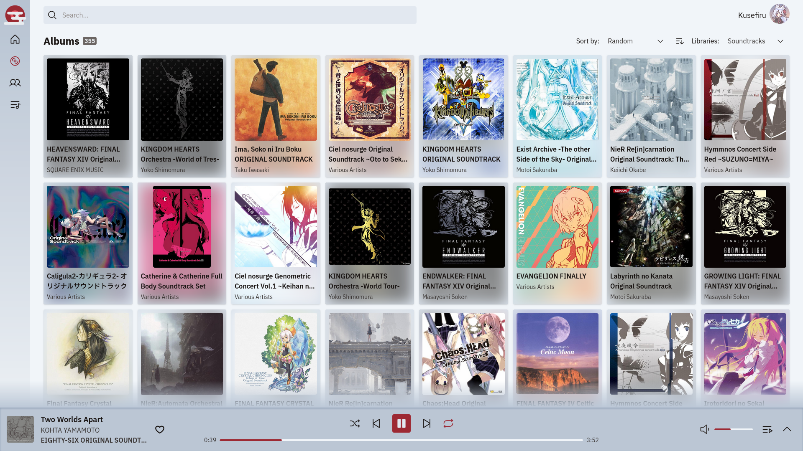
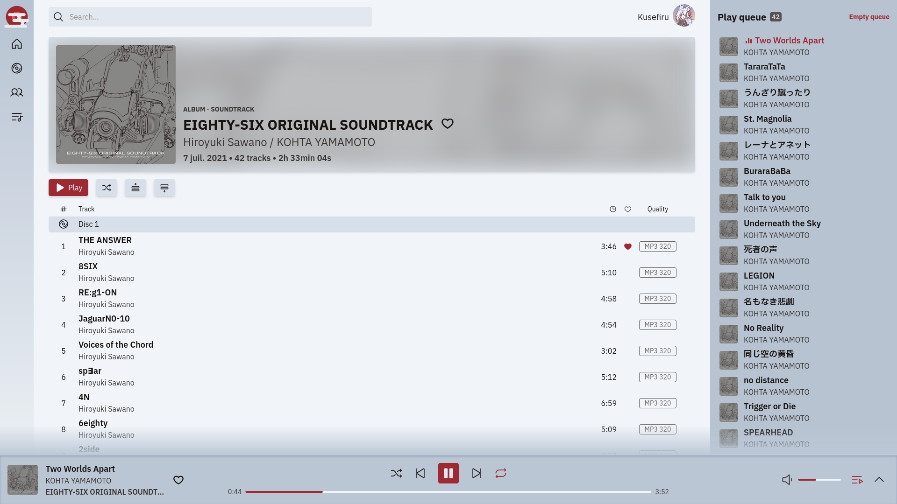

# Mist

A modern, desktop-focused web client for OpenSubsonic-compatible music servers.

> **Note:** Mist is still in development.

## Features

- Clean, responsive UI built with [Svelte 5](https://svelte.dev/)
- Client only: all data is stored locally
- Scrobble tracks to your server
- Immersive fullscreen mode

## Screenshots

<table align="center" border="0">
    <tr>
        <td><a href="./media/screenshot_00_home.png">
             
        </a></td>
        <td><a href="./media/screenshot_01_albums.png">
             
        </a></td>
    </tr>
    <tr>
        <td><a href="./media/screenshot_02_album_id.png">
             
        </a></td>
        <td><a href="./media/screenshot_03_player.png">
             
        </a></td>
    </tr>
</table>

## Installation

### Docker

Images are published to the Github Container Registry on releases (see [here](https://github.com/Kusefiru/Mist/pkgs/container/mist)).
```sh
# Use the latest version
docker run -p 8080:80 ghcr.io/kusefiru/mist:latest

# Use a specific version
docker run -p 8080:80 ghcr.io/kusefiru/mist:VERSION
```

### Docker compose

Supposedly, you can use this.
```sh
services:
  mist:
    image: ghcr.io/kusefiru/mist:latest
    ports:
      - "8080:80"
    restart: unless-stopped
```

### Static files

Mist is entirely client-side, so you can grab the [latest release](https://github.com/Kusefiru/Mist/releases/latest) artefact and run it through a basic nginx setup:
```nginx
server {
    listen 80;

    root /var/www/your-app-name;
    index index.html;

    location / {
        try_files $uri $uri/ /index.html;
    }
}
```

Or you can simply run the included run_server.py Python script, assuming you have Python 3 on your machine. PORT is optional (default to 8000).
```sh
./run_server.py [PORT]
```

> **Note:** This script uses Python basic HTTP server, see [security considerations](https://docs.python.org/3/library/http.server.html#security-considerations).

## Roadmap

This is a non exhaustive of features planned for future releases:

- [ ] Playlists modification
- [ ] Lyrics support
- [ ] Internet radios support
- [ ] Podcasts support
- [ ] Jukebox support
- [ ] Equalization settings
- [ ] More visualizers
- [ ] Native app with [Tauri](https://tauri.app/)

Feel free to request additional features if not listed here.

## Support

Mist works with any server implementing the [OpenSubsonic API](https://opensubsonic.netlify.app/).

Tested with:
- [x] [Navidrome](https://www.navidrome.org/) v0.59.0

If you encounter problems with a specific server, please open an issue.

> **Note:** Mist is built for desktop browsers. I recommend not using it on mobile at all, it hasn't been developed for it at the moment.

## License

[MIT License](./LICENSE)
