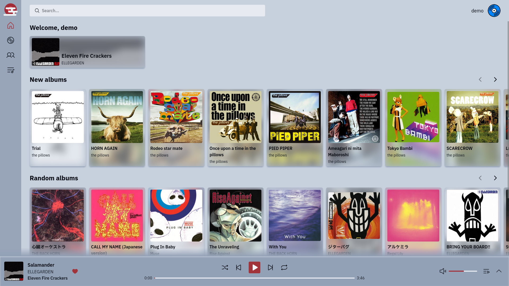
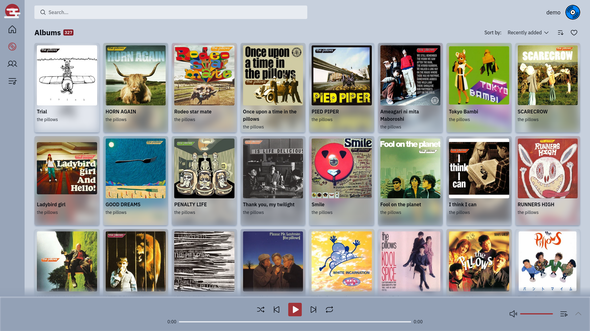
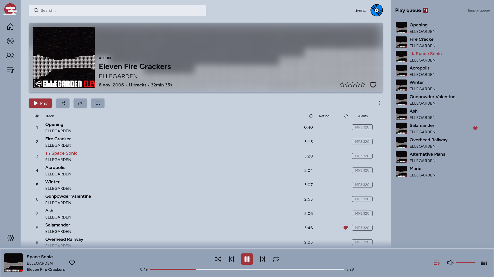
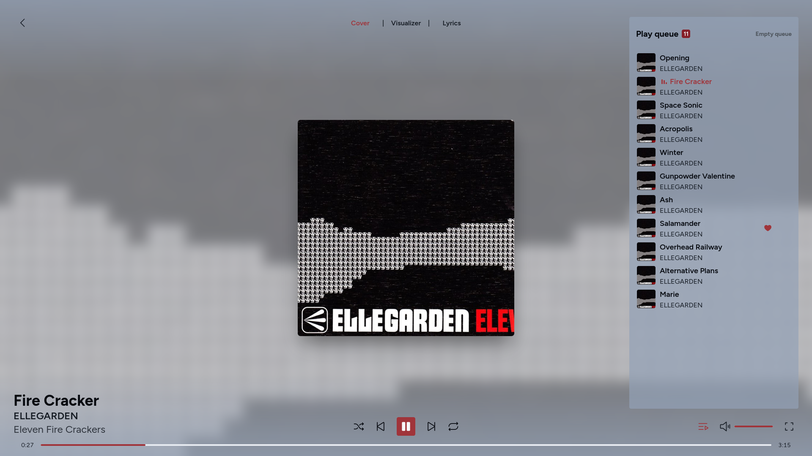
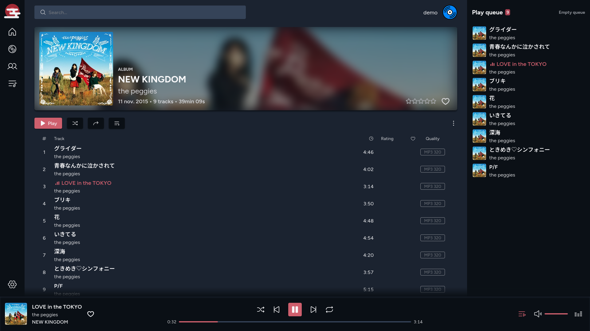
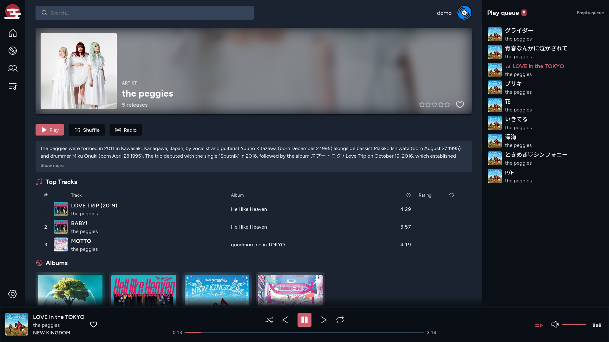

# Mist

A modern, desktop-focused web client for OpenSubsonic-compatible music servers.

> **Note:** Mist is still in development.

## Features

- Clean, responsive UI built with [Svelte 5](https://svelte.dev/), optimized for desktop screens
- Client only, no offline mode: everything runs in your browser
- Scrobble tracks to your server
- Create, edit and delete playlists
- Light and Dark themes support
- Immersive fullscreen mode

## Screenshots

<table align="center" border="0">
    <tr>
        <td><a href="./media/screenshot_00_home.png">
             
        </a></td>
        <td><a href="./media/screenshot_01_albums.png">
             
        </a></td>
    </tr>
    <tr>
        <td><a href="./media/screenshot_02_album_id.png">
             
        </a></td>
        <td><a href="./media/screenshot_03_stage.png">
             
        </a></td>
    <tr>
        <td><a href="./media/screenshot_04_album_id-dark.png">
             
        </a></td>
        <td><a href="./media/screenshot_05_artist_id-dark.png">
             
        </a></td>
    </tr>
</table>

## Installation

### Docker

Images are published to the Github Container Registry on releases (see [here](https://github.com/Kusefiru/Mist/pkgs/container/mist)).
```sh
# Use the latest version
docker run -p 8080:80 ghcr.io/kusefiru/mist:latest

# Use a specific version
docker run -p 8080:80 ghcr.io/kusefiru/mist:VERSION
```

### Docker compose

```sh
services:
  mist:
    image: ghcr.io/kusefiru/mist:latest
    ports:
      - "8080:80"
    restart: unless-stopped
```

### Static files

Mist is entirely client-side, so you can grab the [latest release](https://github.com/Kusefiru/Mist/releases/latest) artefact and run it through a basic nginx setup.
See the [bundled Docker nginx configuration file](./resources/nginx.conf).

You can also instead run the [included Python script](./run_server.py), assuming you have Python 3 on your machine. PORT is optional (default to 8000).
```sh
./run_server.py [PORT]
```

> **Note:** This script uses Python basic HTTP server, see [security considerations](https://docs.python.org/3/library/http.server.html#security-considerations).

## Support

Mist works with any server implementing the [OpenSubsonic API](https://opensubsonic.netlify.app/).

Tested with:
- [x] [Navidrome](https://www.navidrome.org/) v0.63.2

If you encounter a problem with a specific server, please open an issue.

> **Note:** Mist is built for desktop browsers. I recommend not using it on mobile at all, as the interface hasn't been conceived for it.

## Roadmap

This is a non exhaustive list of features planned for future releases:

- Multi-server support
- Lyrics support
- Internet radios support
- Podcasts support
- Jukebox support
- Equalization settings
- More visualizers
- Native app with [Tauri](https://tauri.app/)

Feel free to request additional features if not listed here.

## License

[MIT License](./LICENSE)
